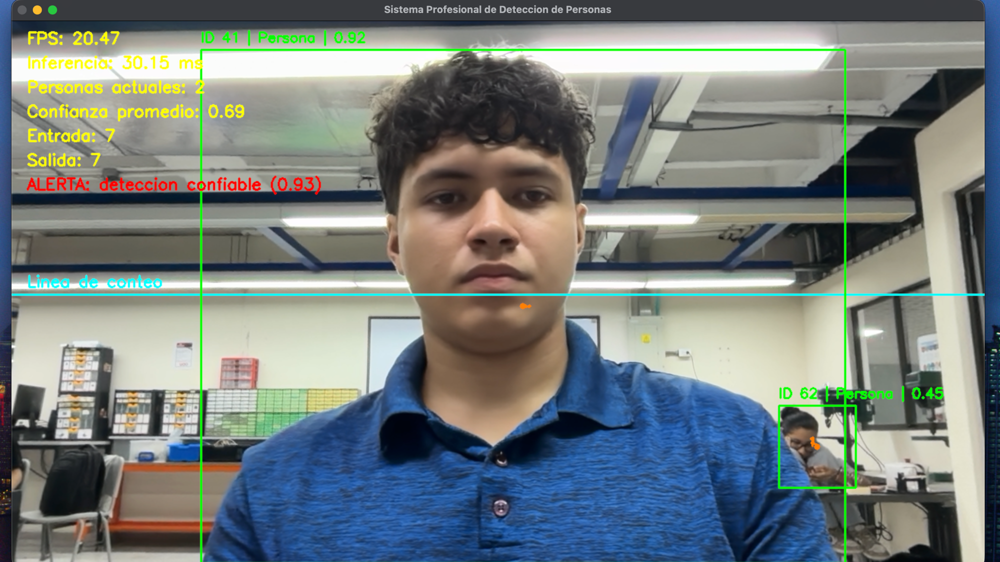
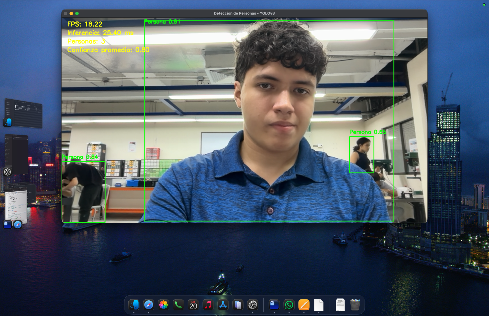
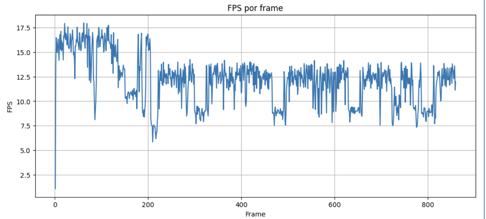
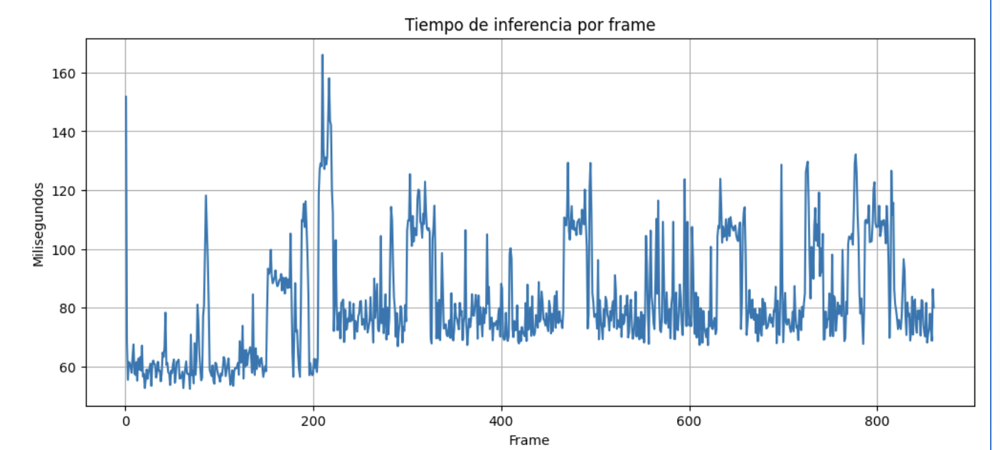
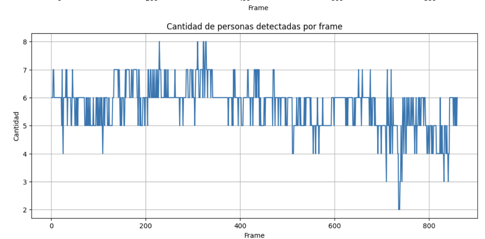
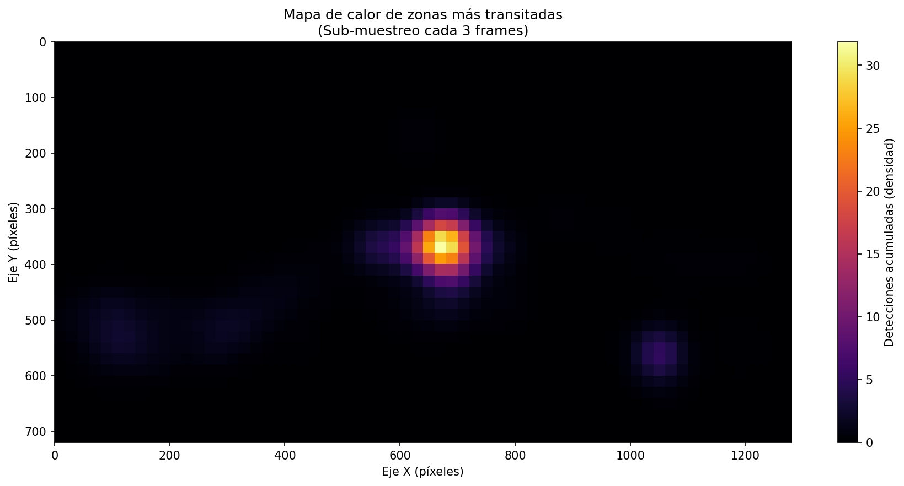
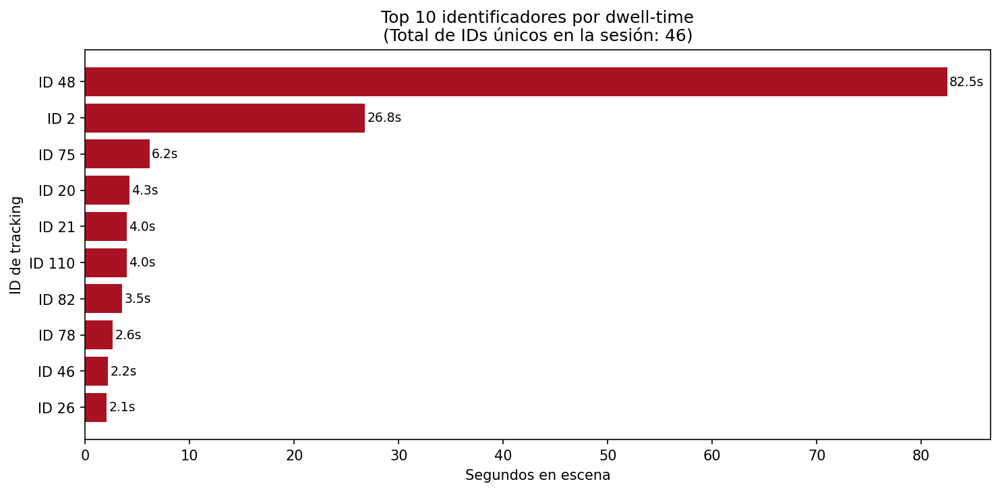

# Detección y Analítica de Personas en Tiempo Real con YOLOv8 + ByteTrack

> **Mi investigación aplicada en visión por computadora.** Construí un pipeline que transforma un flujo de webcam en inteligencia operativa: detecto personas, asigno identidades persistentes, cuento cruces por línea virtual y produzco analítica espacial y temporal post-sesión.

[](https://www.python.org/)
[](https://github.com/ultralytics/ultralytics)
[](https://opencv.org/)
[](https://www.apple.com/)
[](https://www.uao.edu.co/)

---



## 📌 Alcance del proyecto

En este repositorio documento mi investigación práctica sobre el estado-del-arte en **detección de objetos en tiempo real**. Demuestro cómo una combinación de herramientas abiertas — **YOLOv8** de Ultralytics, el tracker **ByteTrack** y **OpenCV** — me permite habilitar capacidades antes reservadas a soluciones comerciales: identifico personas en flujo de cámara, les asigno identidad persistente entre frames, automatizo el conteo por geometría virtual y construyo mapas de comportamiento espacial — todo sobre hardware de consumo, sin GPU dedicada y con un peso de modelo de apenas 6 MB.

### ¿Qué resuelven estas herramientas?

| Capacidad | Aplicación industrial real |
|---|---|
| **Detección por bounding box** | Aforo automático en centros comerciales, control perimetral, conteo de inventario en bodegas |
| **Tracking multi-objeto (ByteTrack)** | Análisis de comportamiento de compradores, seguimiento de pacientes en clínicas, vigilancia inteligente |
| **Conteo por cruce de línea** | Métricas de tráfico peatonal, controles de embarque, conteo de fauna en estudios ecológicos |
| **Heatmap de zonas transitadas** | Optimización de layout retail (cold/hot spots), análisis de exposición en exhibiciones, planificación urbana |
| **Dwell-time por identificador** | Métricas de retención en zonas de interés, evaluación de UX físico, estudios de comportamiento |
| **Alertas en tiempo real** | Detección temprana de aforos críticos, seguridad ocupacional, sistemas anti-caídas en hospitales |

### Niveles de implementación

| Nivel | Lo que implemento |
|---|---|
| **Notebook básico** | Detecto la clase `person` y registro FPS, latencia de inferencia, cantidad por frame y confianza promedio en un CSV |
| **Notebook profesional** | Extiendo el anterior con **tracking persistente vía ByteTrack**, conteo bidireccional por línea virtual, grabación de video anotado en MP4 y un sistema de alertas configurables con cooldown |
| **Bloque 14 (mi aporte de investigación)** | Diseño un módulo de re-inferencia post-sesión sobre el MP4 generado para construir un **heatmap espacial de zonas transitadas** y calcular el **dwell-time real por identificador único** — métricas estándar en analítica de retail y movilidad humana |

Desarrollo este trabajo en el marco del curso **Bases de Datos II** de la **Universidad Autónoma de Occidente (UAO)** como práctica técnica que pienso trasladar a mi proyecto integrador **SICTL — Sistema de Identificación y Clasificación Taxonómica de Lepidópteros**, donde los mismos principios de detección, tracking persistente y registro a base de datos no relacional (MongoDB) serán el núcleo del sistema final.

### Hallazgos clave de mi investigación

- Confirmo que **YOLOv8n sostiene 20 FPS sobre CPU Apple Silicon** sin necesidad de GPU dedicada ni Neural Engine, lo que abre la puerta a despliegues edge sobre dispositivos de consumo.
- Identifico que **filtrar la clase de forma nativa con `model.track(classes=[0])` mejora el rendimiento un +68%** frente al flujo de inferencia genérico, al evitar el NMS sobre clases que voy a descartar.
- Verifico que **ByteTrack mantiene identidades persistentes con re-asociación robusta**: en mi sesión de prueba registré 46 identificadores únicos a lo largo de 2 416 frames con permanencia individual de hasta 82 segundos.
- Observo que **la latencia escala linealmente con la densidad de la escena**: de 30 ms con 1-2 personas a 80 ms con 5-8 personas, comportamiento esperado en arquitecturas anchor-free.

---

## 🎯 Resultados experimentales

Sesión real de 2 416 frames (~2 min) ejecutada en MacBook Air con chip Apple M5.

### Métricas del cuaderno básico

| Métrica | Valor |
|---|---|
| Frames procesados | 860 |
| Detecciones totales | 4 907 |
| FPS promedio | 12.14 |
| Latencia inferencia | 81.89 ms |
| Personas promedio/frame | 5.71 |
| Confianza promedio | 0.5976 |

### Métricas del cuaderno profesional

| Métrica | Valor |
|---|---|
| Frames procesados | 2 416 |
| Detecciones totales | 4 248 |
| FPS promedio | **20.40** |
| Latencia inferencia | **31.73 ms** |
| Confianza promedio | **0.8284** |
| Entradas/Salidas (línea virtual) | 9 / 9 |
| IDs únicos (tracking) | 46 |
| Permanencia máxima | **82.49 s** (ID 48) |

> El cuaderno profesional logra **+68% de FPS** sobre el básico gracias al filtrado nativo de clase `classes=[0]` dentro de `model.track()`, que descarta detecciones no-persona antes del NMS.

---

## 🖼️ Galería de evidencias

### Detección básica con múltiples personas

*El modelo identifica simultáneamente al sujeto principal (0.91) y a dos personas adicionales en segundo plano (0.84 y 0.65).*

### Curvas de rendimiento
| FPS por frame | Latencia de inferencia | Personas por frame |
|---|---|---|
|  |  |  |

### Mejora propia — Bloque 14
| Heatmap de zonas transitadas | Top 10 dwell-time |
|---|---|
|  |  |

---

## 🧠 Arquitectura técnica

```
                ┌─────────────────────────────┐
   webcam ─►   │   OpenCV VideoCapture       │
                │   (1280×720 @ 20 FPS)       │
                └────────────┬────────────────┘
                             │ frame BGR
                             ▼
                ┌─────────────────────────────┐
                │   YOLOv8n + ByteTrack       │
                │   (anchor-free, COCO ckpt)  │
                └────────────┬────────────────┘
                             │ boxes + ids + conf
                             ▼
       ┌─────────────────────┼────────────────────────┐
       ▼                     ▼                        ▼
  Visualización         Conteo cruce               Logger CSV
  (cv2.imshow)          de línea virtual           (pandas)
       │                     │                        │
       ▼                     ▼                        ▼
  Overlay HUD          Alertas tiempo real     Análisis post-sesión
                       (cooldown 2s)            (heatmap + dwell-time)
                                                       │
                                                       ▼
                                              ┌─────────────────┐
                                              │ Mapeo a SICTL   │
                                              │ MongoDB Atlas   │
                                              └─────────────────┘
```

---

## 📂 Estructura del repositorio

```
.
├── README.md                                ← este archivo
├── requirements_deteccion_personas.docx     ← especificación del docente
│
├── deteccion_personas_basico.ipynb          ← cuaderno base (13 celdas)
├── deteccion_personas_profesional.ipynb     ← cuaderno avanzado (15 celdas)
│
├── generar_word_lab18.py                    ← genera el informe Word
├── procesar_mejora_real.py                  ← Bloque 14: heatmap + dwell-time
├── insertar_imagen.py                       ← utilitario para inserciones
├── reemplazar_figura10_por_tabla.py         ← tabla con datos del CSV pro
├── finalizar_doc.sh                         ← pipeline completo
│
├── metricas_deteccion_personas.csv          ← métricas del notebook básico
├── metricas_deteccion_personas_profesional.csv  ← métricas del profesional
├── heatmap_zonas.png                        ← salida del Bloque 14
├── dwell_time_top10.png                     ← salida del Bloque 14
├── frame_representativo.png                 ← frame extraído del MP4
├── resumen_pro.json                         ← métricas serializadas
│
└── docs/img/                                ← capturas del README
```

> El video `salida_deteccion_personas_profesional.mp4` (114 MB) lo dejo fuera del repo porque excede el límite de GitHub por archivo (100 MB). Lo regenero ejecutando el notebook profesional.

---

## 🚀 Cómo ejecutar

### 1. Crear entorno

```bash
conda create -n yolo python=3.10 -y
conda activate yolo
pip install ultralytics opencv-python pandas numpy matplotlib jupyter scipy python-docx
```

### 2. Permisos de cámara (macOS)

Configuración del Sistema → Privacidad y seguridad → Cámara → autorizar la terminal que vaya a lanzar Jupyter.

### 3. Ejecutar cuaderno básico

```bash
jupyter lab deteccion_personas_basico.ipynb
```

Ejecutar las celdas con `Shift+Enter`. En la celda del bucle de detección, presionar **`Q`** sobre la ventana de OpenCV para terminar la captura.

### 4. Ejecutar cuaderno profesional

```bash
jupyter lab deteccion_personas_profesional.ipynb
```

Caminar de un lado al otro de la línea cyan para que el contador entrada/salida se incremente. Genera automáticamente:
- `salida_deteccion_personas_profesional.mp4` (video anotado)
- `metricas_deteccion_personas_profesional.csv`

### 5. Ejecutar el Bloque 14 (mejora propia)

Como script independiente:

```bash
python procesar_mejora_real.py
```

Genera `heatmap_zonas.png` y `dwell_time_top10.png` a partir del MP4 (sub-muestreo cada 3 frames, ~60s de cómputo).

### 6. Regenerar el informe Word

```bash
export STUDENT_CODE="XXXXXXX"   # opcional: código del autor para la portada
./finalizar_doc.sh
```

---

## 🔬 Bloque 14 — Mejora propia (post-procesamiento analítico)

El profesor entregó únicamente los notebooks base/profesional. Como aporte propio diseñé un módulo de **analítica post-sesión** que opera sobre el archivo MP4 generado por el cuaderno profesional: re-inferencio con `model.track(persist=True)` para obtener centroides y trayectorias persistentes. Los resultados los materialicé en dos visualizaciones complementarias:

- **Heatmap de zonas transitadas** — grilla de 64×36 con suavizado gaussiano (σ=1.5) sobre 1 104 centroides agregados.
- **Dwell-time por identificador** — gráfico de barras con los 10 IDs de mayor permanencia en escena. Top: ID 48 con **82.49 s** sostenidos.

Ambas métricas son **estándar de la industria** en analítica de retail y movilidad humana, lo que vincula directamente el laboratorio con casos de uso productivos reales.

---

## 🦋 Conexión con el proyecto SICTL

| Concepto en este lab | Equivalente en SICTL |
|---|---|
| Bounding box de persona | Bounding box de mariposa en imagen de campo |
| ID persistente por tracking | Trazabilidad de un mismo ejemplar en múltiples avistamientos |
| Conteo por cruce de línea | Avistamientos en zonas/cuadrículas geográficas |
| Exportación a CSV | Inserción en colección `avistamientos` de MongoDB Atlas |
| Confianza por detección | Score taxonómico de identificación de especie |

---

## 📚 Referencias

- Jocher, G., Chaurasia, A., & Qiu, J. (2023). [Ultralytics YOLOv8](https://github.com/ultralytics/ultralytics).
- Redmon, J., Divvala, S., Girshick, R., & Farhadi, A. (2016). *You Only Look Once: Unified, Real-Time Object Detection*. CVPR.
- Zhang, Y. et al. (2022). *ByteTrack: Multi-Object Tracking by Associating Every Detection Box*. ECCV.
- Lin, T. Y. et al. (2014). *Microsoft COCO: Common Objects in Context*. ECCV.
- Bradski, G. (2000). The OpenCV Library. Dr. Dobb's Journal of Software Tools.

---

## 👤 Autor

**Joan Mateo Cardona**
Ingeniería Informática · Universidad Autónoma de Occidente · Cali, Colombia
Curso: **Bases de Datos II** · Docente: Julián René Muñoz · 18 de abril de 2026

> Este repositorio hace parte de mi portafolio académico — lo concibo como una investigación sobre el potencial de los modelos de detección en tiempo real aplicados a casos de uso de bases de datos y analítica.
